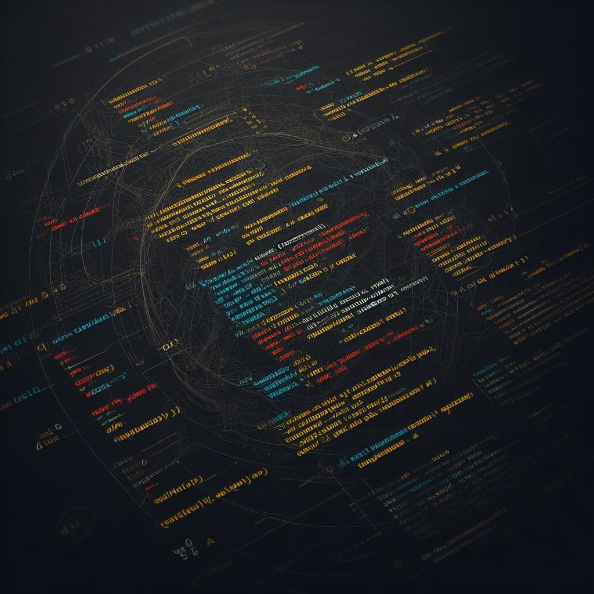

    
    
    <h1 style="text-align: center; font-weight: 600; color: lightblue; margin: 0;">HELLO, WORLD!</h1>
    <h3 style="text-align: center; color: lightblue; margin: 0; font-size: 16px; font-weight: 300">Меня зовут Кирилл. Я frontend-разработчик</h3>

##### 💁🏻‍♂️ О себе:
* Я изменил свой путь, оставив за собой карьеру железнодорожника и обретя новую страсть к фронтенд-разработке 
* Имею уникальный опыт работы в разных сферах, что позволяет мне глубоко понимать бизнес-потребности и интегрировать их в веб-разработку
* Пишу чистый код по принципам Роберта Мартина
* Увлекаюсь JavaScript и постоянно изучаю новые технологии
* Готов к любым вызовам и хочу присоединиться к команде, где смогу развивать свои навыки и вносить ценный вклад

#### [Мой телеграмм](https://t.me/kirgo_r)
#### [Я ВКонтакте](https://vk.com/kirgo_r)

##### ⚡Для меня главное:

* Работа в команде профессионалов
* Писать понятный и чистый код
* Всегда учиться и осваивать новые технологии

---

##### ⚡Мой стек:

   

   

  

     

---
#### 🐶 Мои pet-проекты

#### 📈 Статистика

